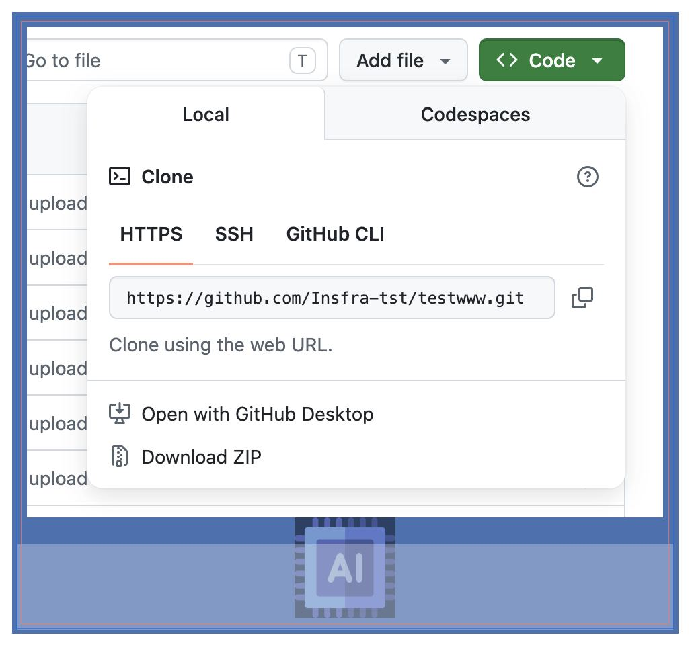
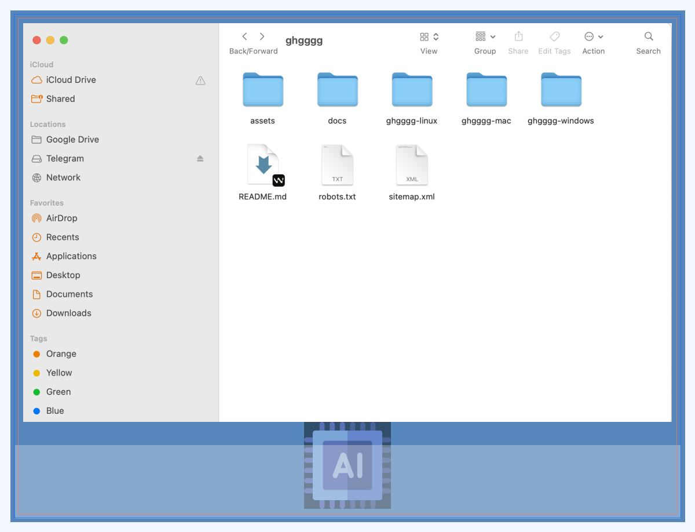

# ssddqwdwqdq

💀 🛠️ ⚙️ 🔧 📦 💻 🖥️ ⚡ 🚀 🧩 🔨 🗂️ 📁 👾
 

 
👾 📁 🗂️ 🔨 🧩 🚀 ⚡ 🖥️ 💻 📦 🔧 ⚙️ 🛠️ 💀

<table><thead><tr><th>Tool</th><th>Type</th><th>GitHub</th><th>Download / Website</th></tr></thead><tbody><tr><td>LanguageTool</td><td>Grammar, spelling, style</td><td><a href="https://github.com/languagetool-org/languagetool?utm_source=chatgpt.com">GitHub Repo</a></td><td><a href="https://languagetool.org/?utm_source=chatgpt.com">LanguageTool Website</a></td></tr><tr><td>Harper</td><td>Privacy-first grammar checker</td><td><a href="https://github.com/Automattic/harper?utm_source=chatgpt.com">GitHub Repo</a></td><td><a href="https://writewithharper.com/?utm_source=chatgpt.com">Harper Website</a></td></tr><tr><td>Scramble</td><td>AI writing assistant Chrome extension</td><td><a href="https://github.com/zlwaterfield/scramble?utm_source=chatgpt.com">GitHub Repo</a></td><td>GitHub releases</td></tr><tr><td>Hemingway Editor</td><td>Readability &amp; style improvement</td><td>No official GitHub</td><td><a href="https://hemingwayapp.com/?utm_source=chatgpt.com">Hemingway Editor</a></td></tr><tr><td>Slick Write</td><td>Grammar &amp; style analysis</td><td>No official GitHub</td><td><a href="https://www.slickwrite.com/?utm_source=chatgpt.com">Slick Write</a></td></tr><tr><td>QuillBot</td><td>Grammar, paraphrasing, rewriting</td><td>No official GitHub</td><td><a href="https://quillbot.com/?utm_source=chatgpt.com">QuillBot</a></td></tr><tr><td>ProWritingAid</td><td>Grammar, style, reports</td><td>No official GitHub</td><td><a href="https://prowritingaid.com/?utm_source=chatgpt.com">ProWritingAid</a></td></tr></tbody></table>

## Screenshots

## Repository Files

- `assets/preview.png` and `assets/screenshots/` contain generated images.
- `ssddqwdwqdq-windows/`, `ssddqwdwqdq-mac/`, and `ssddqwdwqdq-linux/` contain extracted EX Creator ZIP files.
- `docs/` contains install, FAQ, and troubleshooting pages.

## Source downloads

- Windows: No source ZIP found in post content.
- Mac: No source ZIP found in post content.
- Linux: No source ZIP found in post content.
